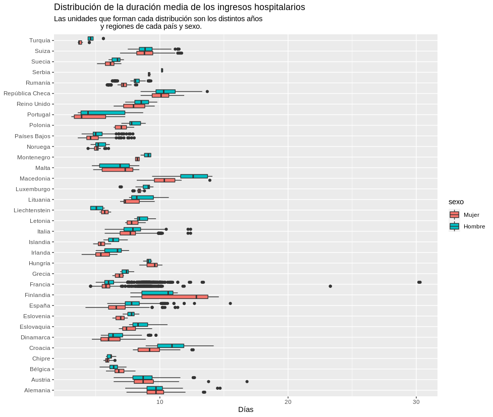
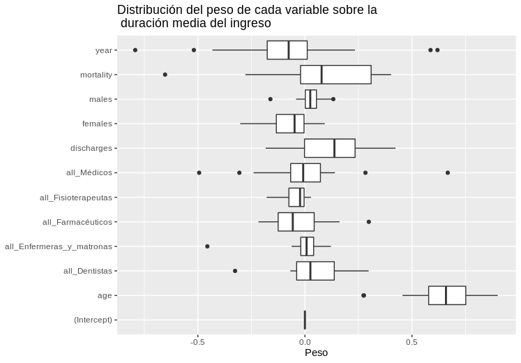

# European health quality analysis
This project aims to explore and analyse several Eurostat health datasets. It is the coding part of a final thesis on European Healthcare for the Data Science Master Degree at Universitat Oberta de Catalunya.

## Findings about lenght of stay per country

## Coeficients for the correlation model

## Notebook
A more detailed overview can be found in [this notebook](https://data.cobiella.es/eurostat_health.html), which is an extended version of `per_country.Rmd`

# Files
## Code files
* `prepare_metadata.py` Downloads, process and stores metadata.
* `download_data.py` Downloads datasets from Eurostat.
* `transform_eurostat_data.py` Defines function to load and preprocess Eurostat health datasets.
* `preprocess.R` Preprocess each individual dataset assigning specific factor levels.
* `exploration.R` Datasets exploration.
* `exploration.Rmd` Same exploration as `exploration.R`, but as R markdown notebook.
* `explore_icd10.py` Explore differences between various sources of ICD-10 codes.
* `export_subdata.R` Exports different tables to disk as Rdata files, one file per table per country.
* `per_country.Rmd` Explores data per country and models linear regressions for each one.
* `latex_tables.R` Outputs coeficient tables in Latex.

## Metadata files
These files have been manually collected from several sources, so they are included in the repository.
* `data/datasets_metadata.json` Includes short name, description and file url for each dataset. [Source](https://ec.europa.eu/eurostat/web/health/data/database)
* `data/health_professionals_metadata.json` Includes ID, name and description for each professional category. Sources:  [Explanatory texts](https://ec.europa.eu/eurostat/cache/metadata/en/hlth_res_esms.htm) [Data browser 1](https://ec.europa.eu/eurostat/databrowser/view/hlth_rs_prshp1/default/table?lang=en) [Data browser 2](https://ec.europa.eu/eurostat/databrowser/view/hlth_rs_prsrg/default/table?lang=en)
* `data/tags.json` Eurostat standard flags. These apear sometimes next to numerical values to indicate additional metadata about the observation. [Source](https://ec.europa.eu/eurostat/statistics-explained/index.php/Tutorial:Symbols_and_abbreviations)
* `data/COD_2012_edited.csv` Manually edited version of the [2012 Eurostat shortlist for ICD-10](https://ec.europa.eu/eurostat/ramon/nomenclatures/index.cfm?TargetUrl=LST_CLS_DLD&StrNom=COD_2012&StrLanguageCode=EN&StrLayoutCode=) (International Code for Diseases and Health Problems). The datasets use the [2007 version](http://dd.eionet.europa.eu/vocabulary/eurostat/icd10/), but only the 2012 file includes levels to aggregate codes.
